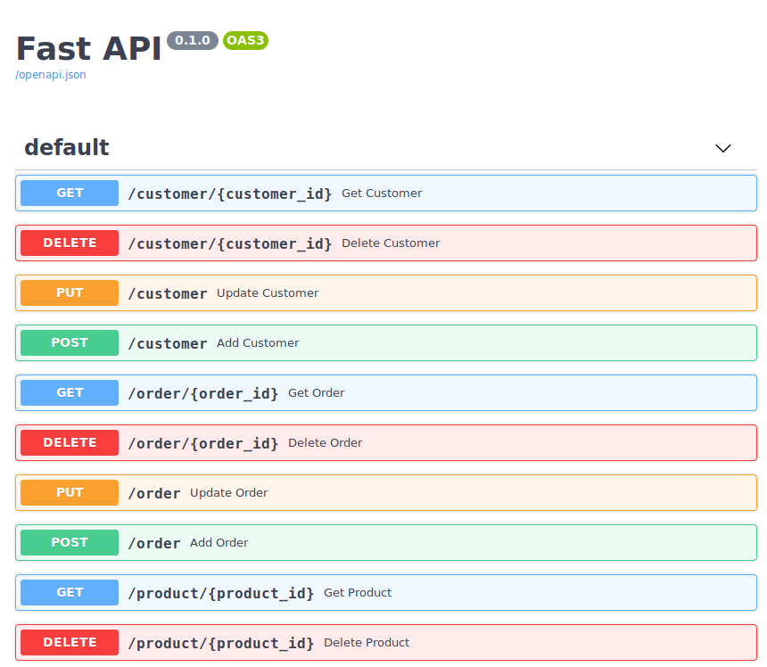
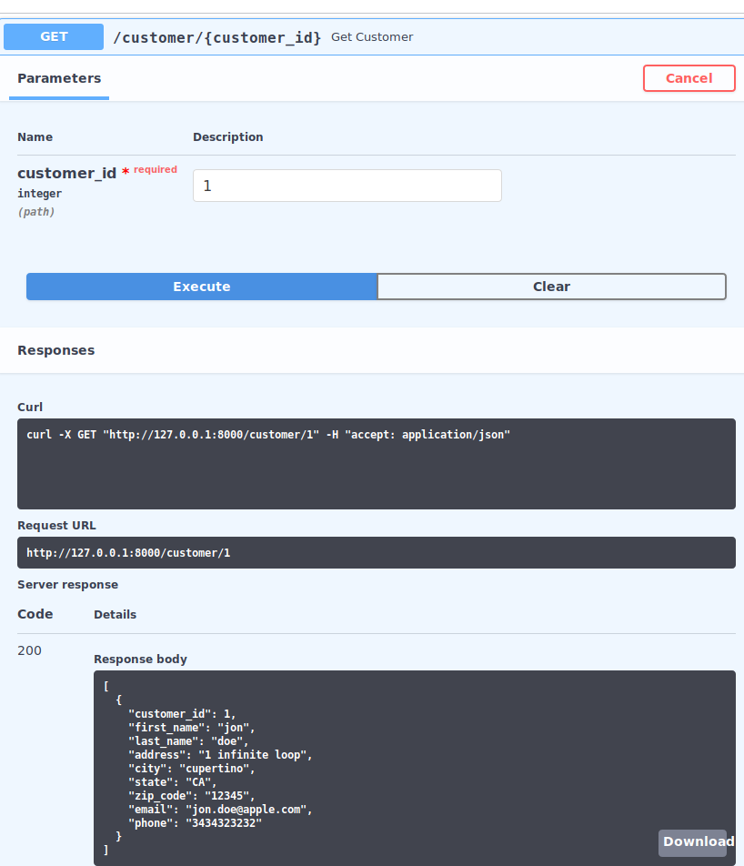

use [sql_scripts](sql_scripts) to create tables and insert dummy data into your postgres server and then point connection string in ```settings.conf``` to this database


then simply run the following commands:
```bash 
cd src
sudo apt-get install libpq-dev python3-dev 
pip3 install -r requirements.txt
uvicorn app:app --reload 
```

### docs


### example of a get method

